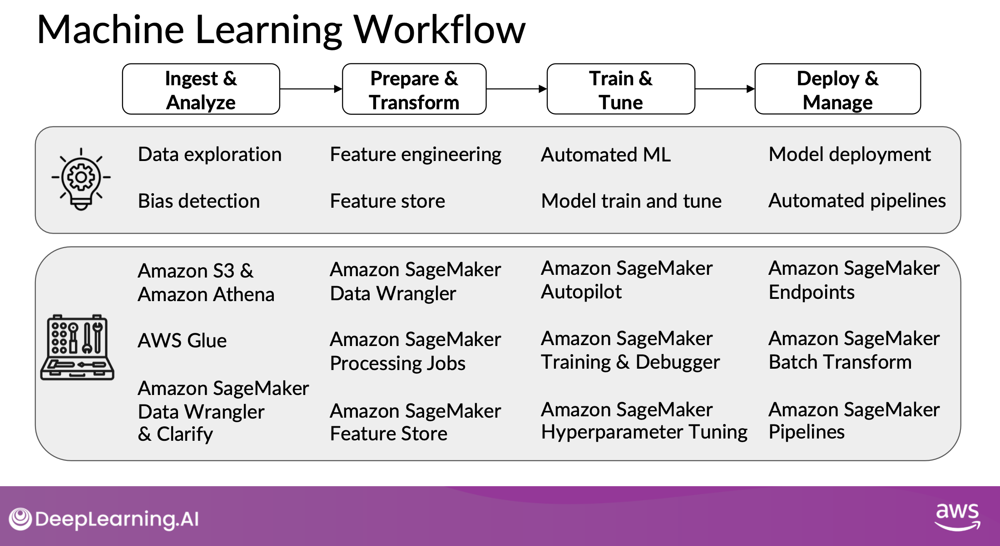

# practical-aws
This repo is for the [Practical Data Science on the AWS Cloud Specialization](https://www.coursera.org/specializations/practical-data-science).

Course assignments are done within the course AWS lab, and then redone within my own AWS account using Sagemaker Studio. The goal is to learn how to navigate AWS roles, policies, APIs, and other functionality necessary for deploying my own ML applications on AWS Sagemaker.

***

1. [Course 1: Analyze Datasets and Train ML Models Using AutoML](https://github.com/curtpond/practical-aws/tree/main/nb/week1)
2. [Course 2: Build, Train, and Deploy ML Pipelines Using BERT](https://github.com/curtpond/practical-aws/tree/main/nb/week2)

